# UI Prototypes

In this file the design of the web application **seeSea,** a web app used for ship tracking purposes, is displayed using wireframes generated using figma.

## Authentication Pages

### Welcome Page

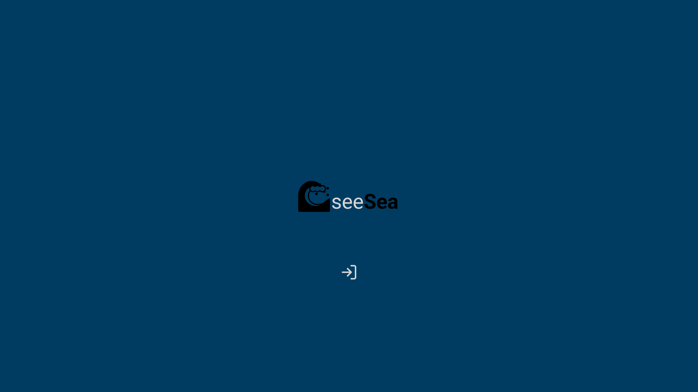

### Sign In Page

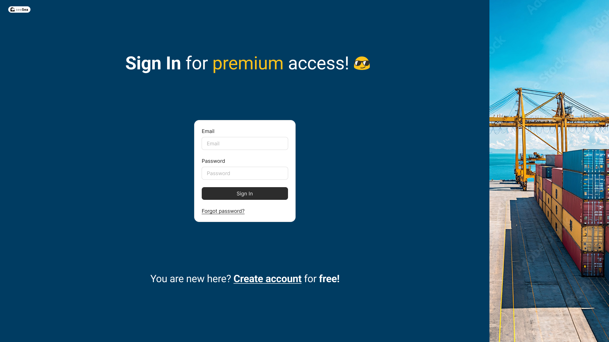

### Sign Up Page

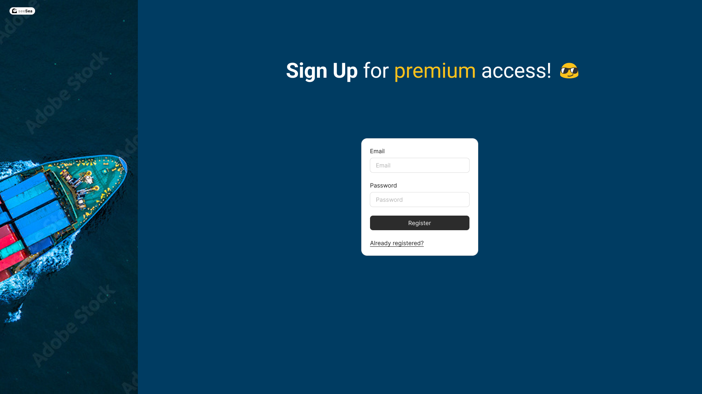

## Admin Pages

### Main Page

We can see the main page of the admin user. On the left we can see the main category window where the tabs **My Fleet**, **Alerts** and **Filters** exist. At middle top there is a search bar where the user can search something specific. On the map we can see all the vessels available within the database given. At the bottom left of the window there is a notifications drag window where alerts will appear. More about alerts to be discussed later on. At middle bottom a zoom in/zoom out button exists. At bottom right coordinates of the cursor will appear.

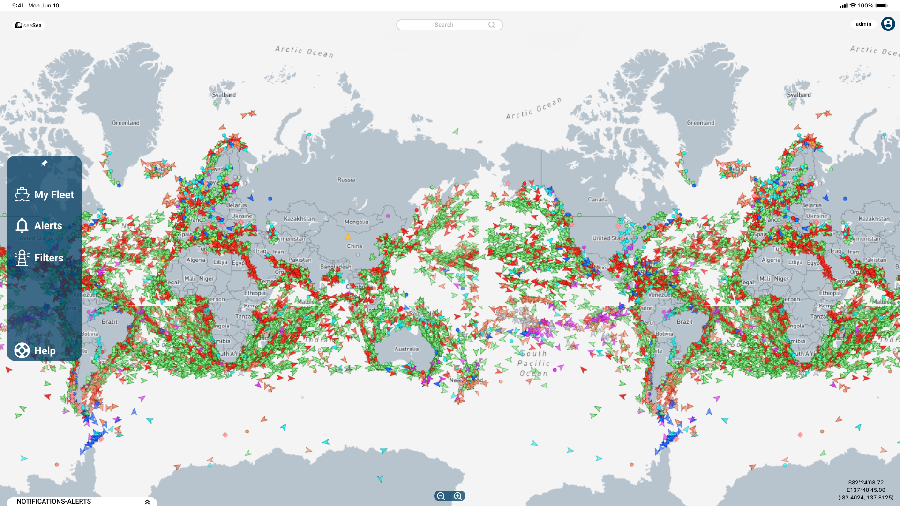

### Ship Info

Selecting a vessel will open a pop up window where information about it will appear. There is an option to add the selected vessel to your fleet. Admin users, can edit the static info of a vessel, e.g. type of vessel.

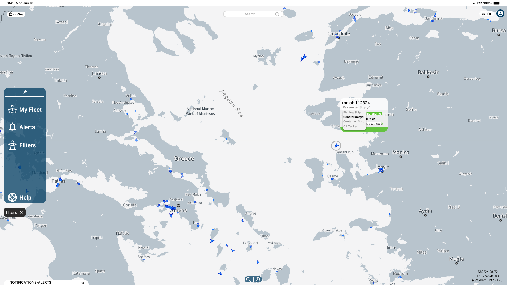

## Registered User Pages

### Main Page

Clicking on the avatar a drop down menu appears. The user can either enter **settings** page where he can edit his personal info, or **log out**.
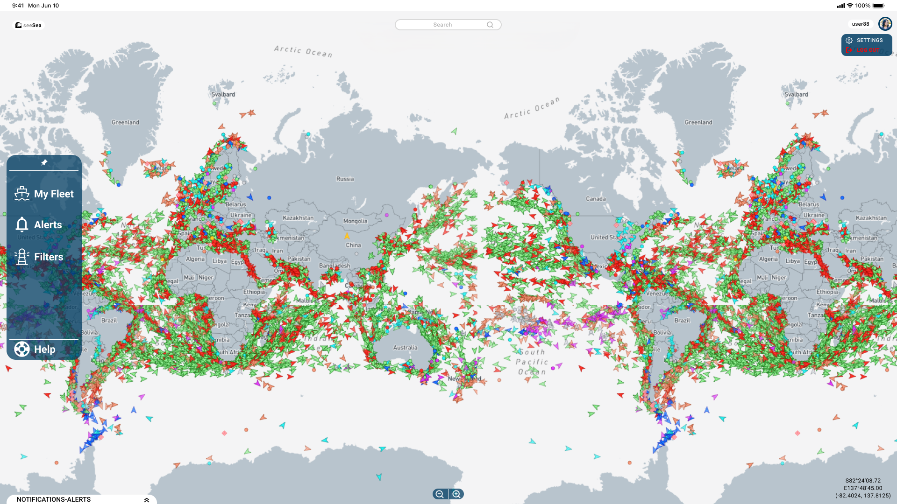

### My fleet tab

Clicking on the **My Fleet** option of the left bar, registered users have the ability to view ships of their fleet. Adding ships to this list is done by either clicking on a ship or searching for one via the search bar at the top, this opens the ship info pop-up and then users can add or remove a ship using the buttons "add to fleet" or "remove from fleet" respectively.

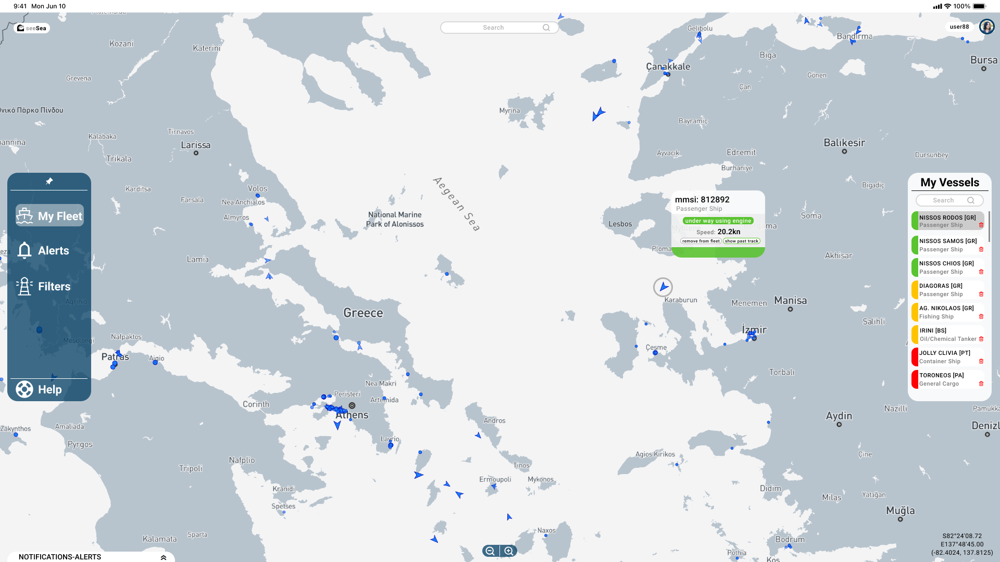

### Filters Tab

Registered users can also limit the set of ships they see on the page at a given time by using filters. Filters are based on ship type and status. Filters can either be applied on all available ships of the page or only at the ships that belong to the user's fleet.

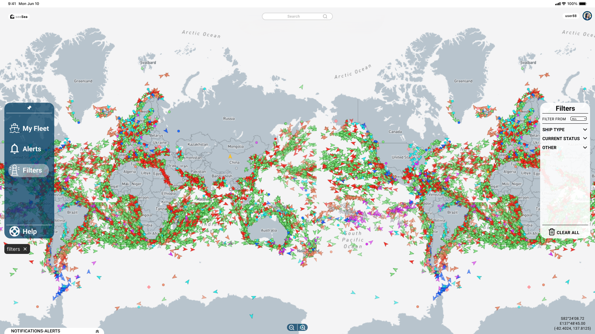

### Filters Tab with Selected option

Example in Filters Tab with a selected filter option where only fishing ships are being displayed.

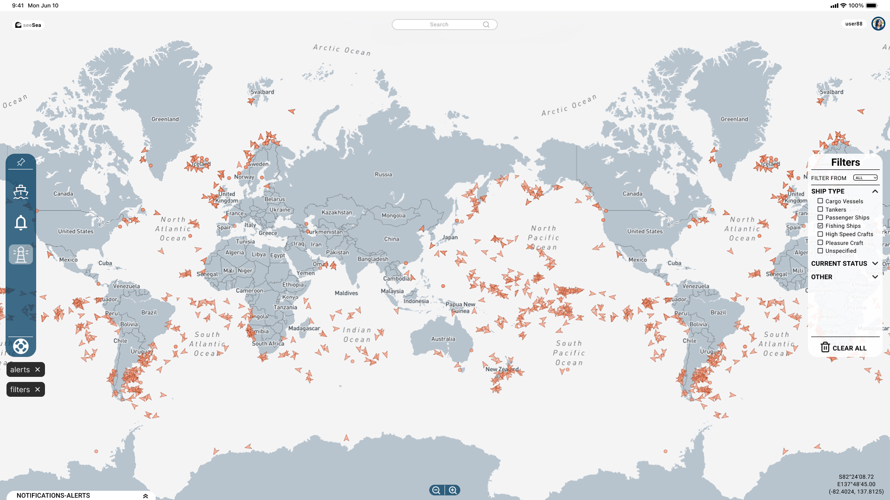

### Alerts Tab

Clicking on **Alerts** Tab, the user has the ability to select a zone of interest by using his mouse. Then he can select from the window that opens on the right, some restrictions for which he gets notified. The notifications/alerts will be available on the notifications sector.

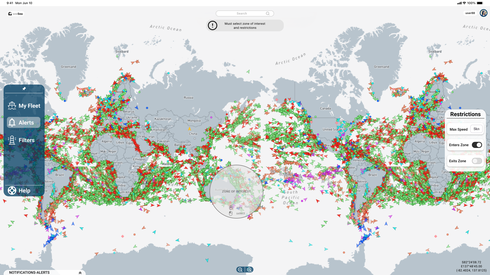

After the selection of the zone of interest, the zone becomes red. If someone wants to change it, a click must be done so the zone gets unpinned.

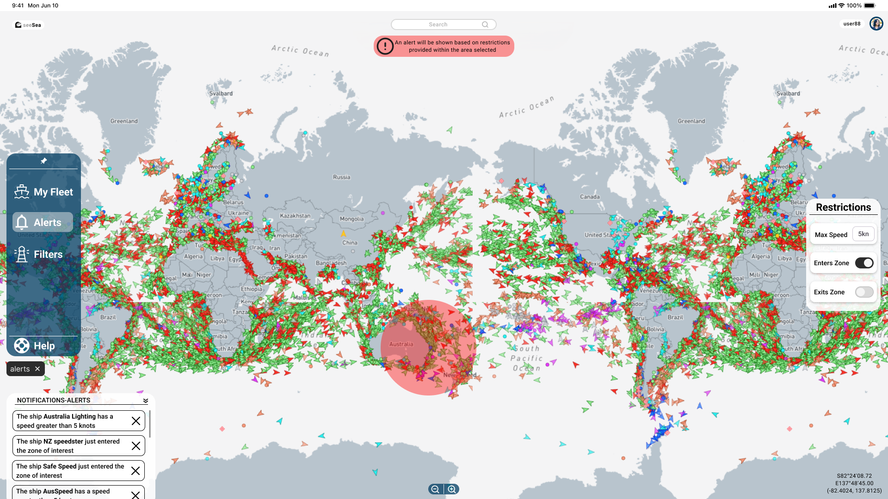

Tags are open when filters or alerts are enabled. They can be closed easily by closing the tags.

## Guest User Pages

Guests have access on the main page of the map and can see all the vessels' positions available. They can also watch info about specific vessels by clicking on them.

Guest users can also watch ship movement history for up to twelve hours.

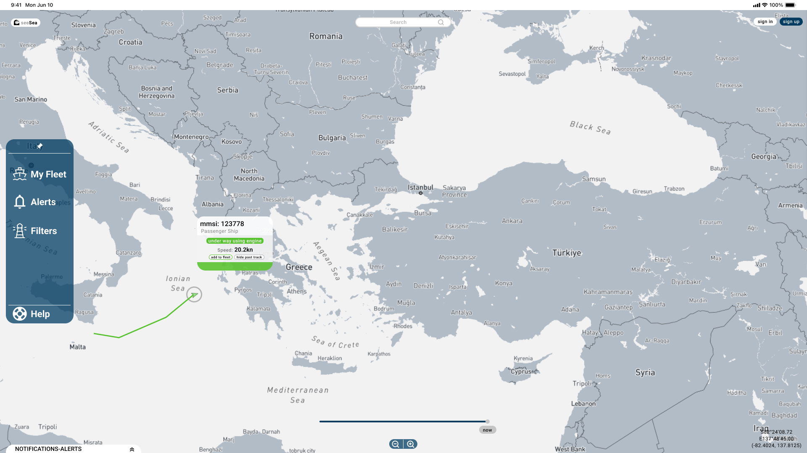

If a guest user tries to enter **Filters** or **Alerts** Tab, considered as premium content, a pop up is shown, where he is being asked to sign in or register, if he has not already an account.

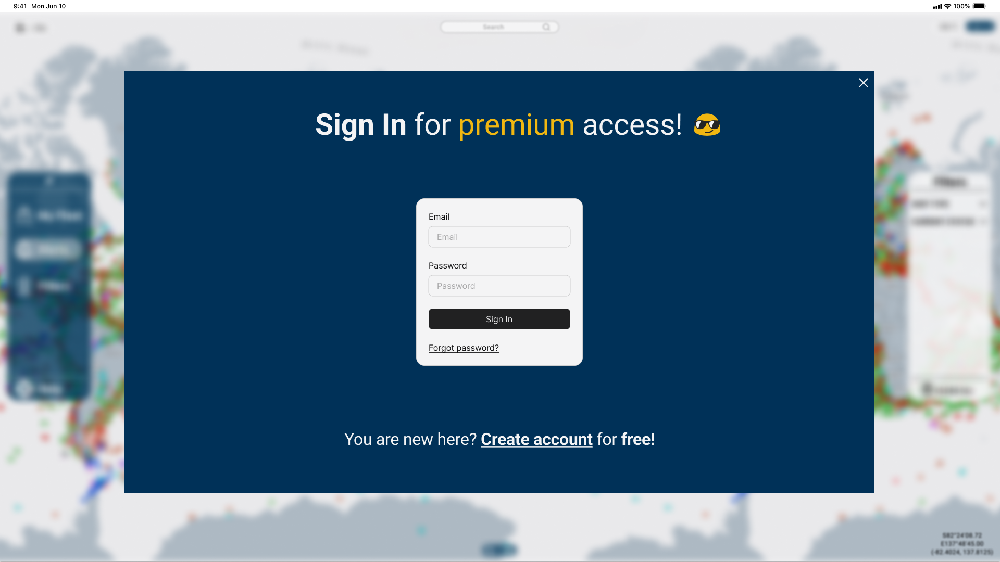
